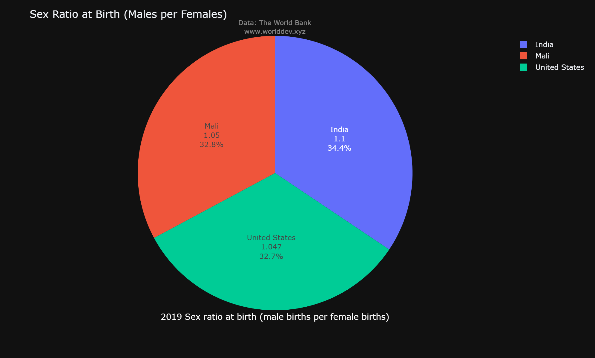
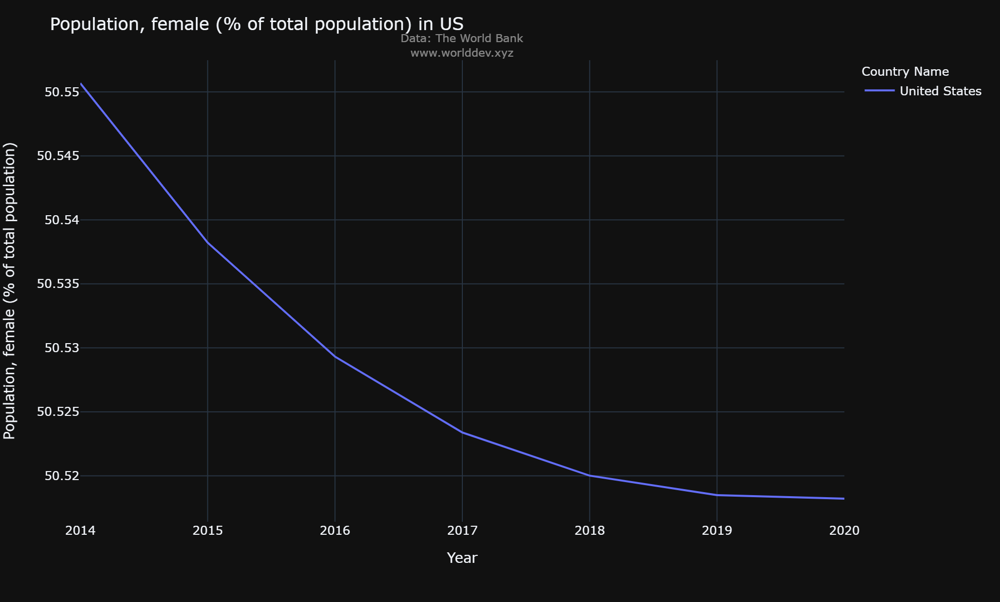
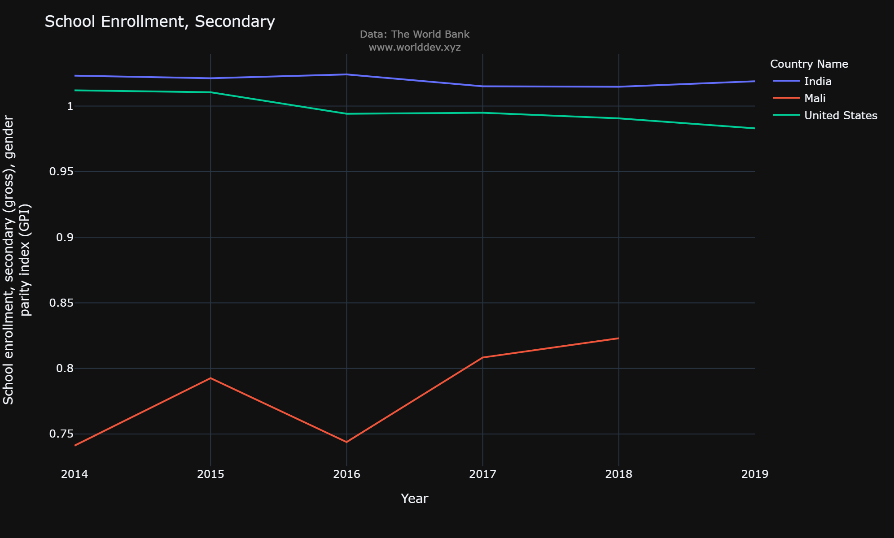

# **A Perspective On Gender Inequality From 2014 to 2019**

##### -Arushi Agarwal
###### March 12, 2022
---

### **Introduction**
The history of gender inequality has been there since ages. Although the developed countries have overcome such issues drastically in past decades and started making improvements by instituting the policies which can safegaurd females rights. 

### **Analysis and Strategy**
1. **Countries Under Scope:** We will look at data for three types of countries: Developed [USA], Developing [India], Under-developed [Mali].
2. **Data Source:** https://www.worlddev.xyz/
3. **Time Span:** 2014 - 2019
4. **Indicators:**
    - Sex Ratio
    - Education

Even from the birth in developing and under-developing countries, there is an imbalance in the sex ratio. Looking at the past 5 years data [2014 – 2019], the number of males birth is higher in India and Mali as compared to United states. The are numerous reason which are leading to such higher sex-ratio at birth, namely, peference of male child over female, overall expenses of male vs female etc. As of 2019, India sex ratio at birth (male per female) is 1.1 and Mali is at 1.05 as compared to USA which has 1.047 as shown in the graph below.

Looking closely in each of these three different socio-economic countries. We can easily see a significant trend in developing countries which are making progress by instituting a significant change in the work and social environment which are making awareness for female rights development. For example in the graph below which demonstrates the percentage of females out of total population in a span of 5 years is significantly seeing an uptrend (0.04%). However analyzing Mali (an under-developed country), we see a downward trend (0.1%) for percentage of females out of total population. Interestingly, we also see a downward trend (0.03%) in percentage of females out of total population in United States of America.

Even at the secondary education level, percentage of females in India (47.5%) and Mali (43.6%) are lower then United States (49.17%). It again representes a vast gap in gender ineuqality for basic education in developing and under-developed countries. This gap can be attributed to multiple socio-economic constraints.

### **Conclusion**

As per the initial assessment in three diverse countries, achieving gender equality requires a lot of efforts in least developed countries as they need proper infrastructure, information dissemination and resources. Developing country such as India is looking a upward trends as more female are getting opportunities to continue education at primary and secondary level. Additonally, more multinaltional companies are moving to developing countries and making changes in instituion by implementing gender equality policies.

