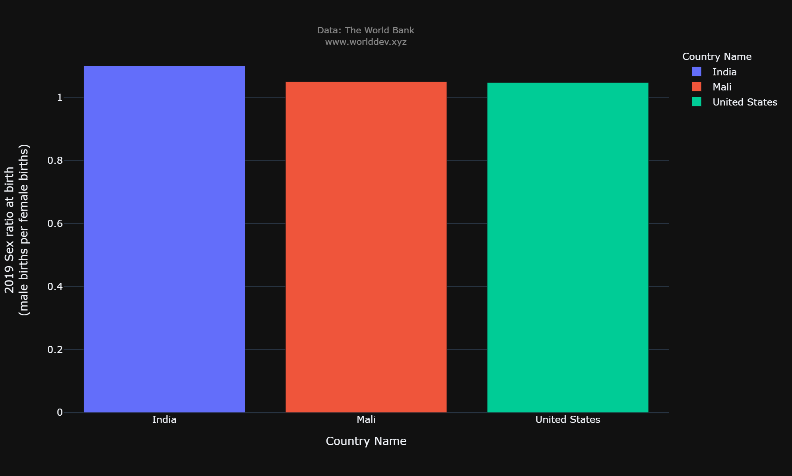
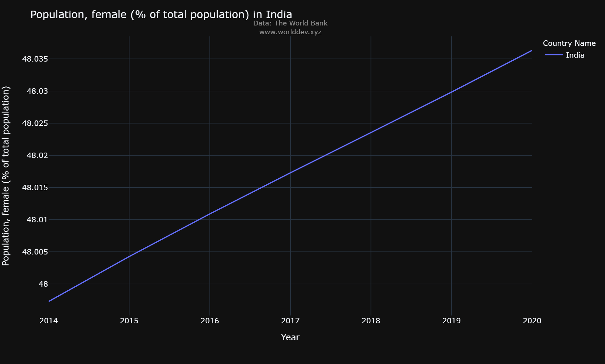
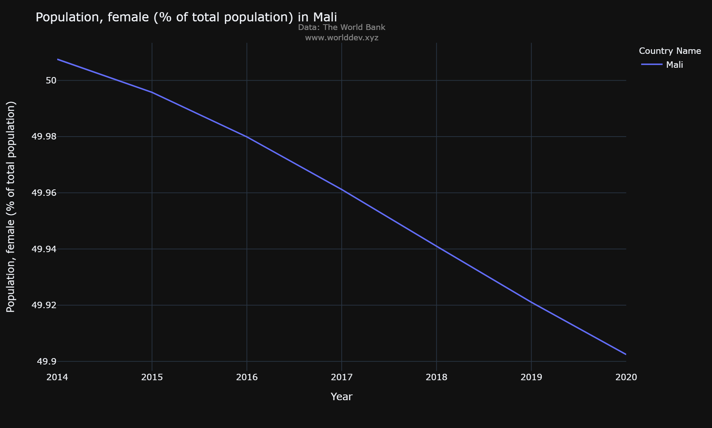
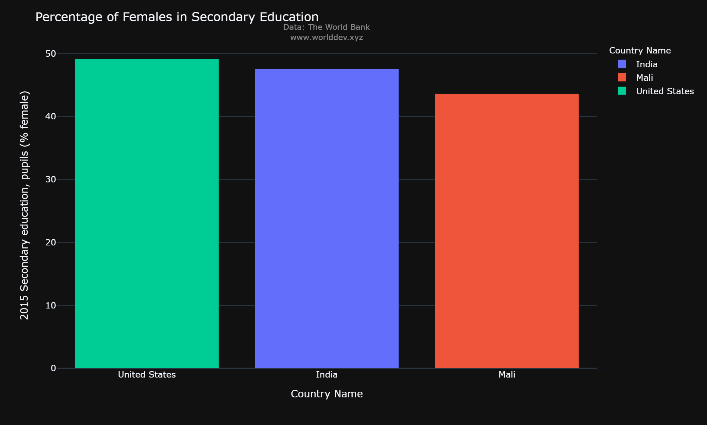
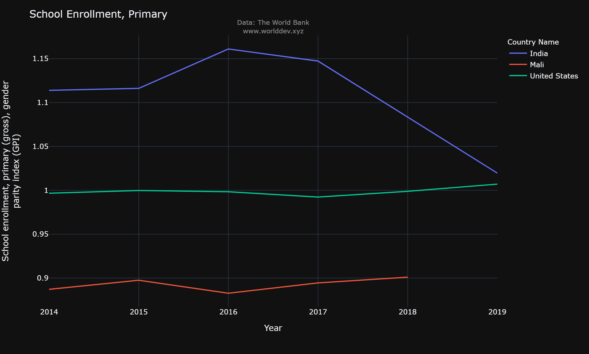
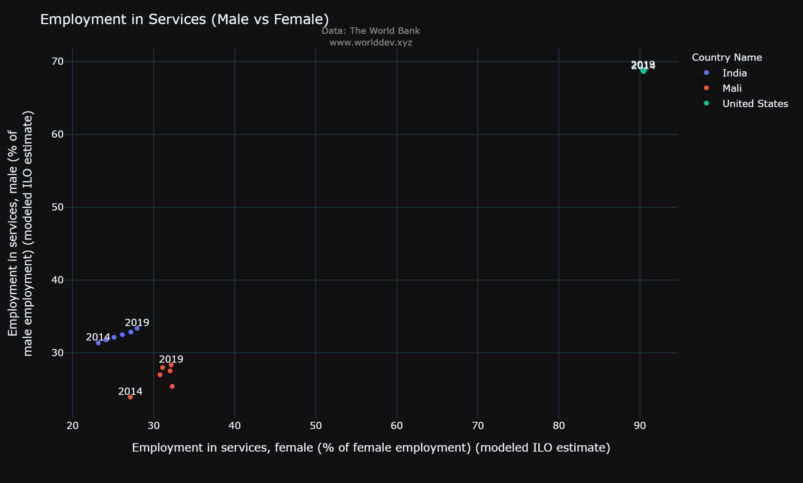
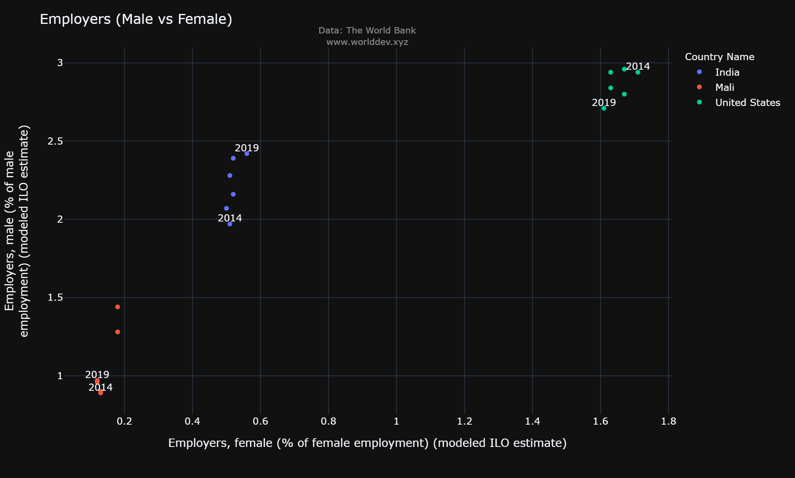
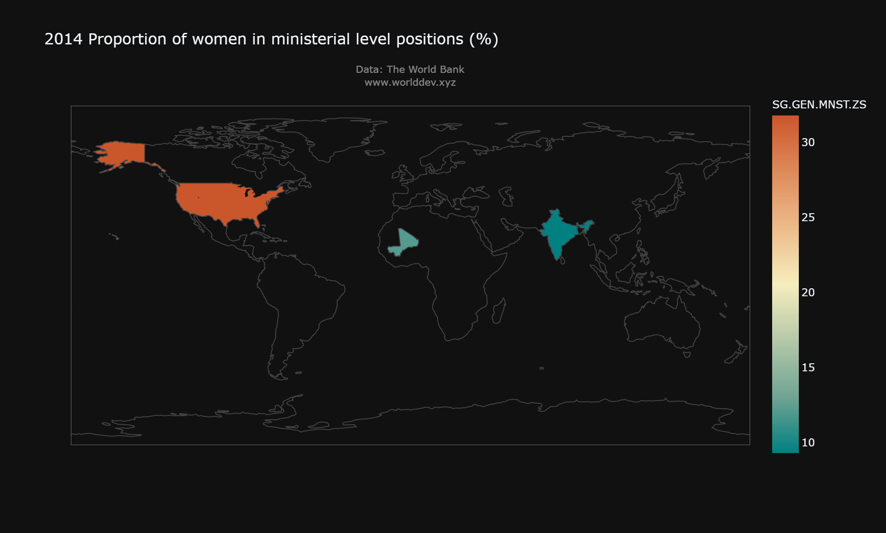
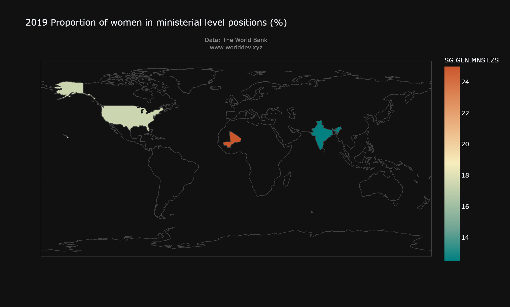

# **A Perspective On Gender Inequality From 2014 to 2019**

##### -Arushi Agarwal
###### March 12, 2022
---

### **Introduction**
The history of gender inequality has been there since ages. Although the developed countries have overcome such issues drastically in the past decades and started making improvements by instituting the policies which can safegaurd female rights. This article will focus on difference and progress made on gender issues. We will look at data for three types of countries: Developed [USA], Developing [India], Under-developed [Mali]. Although there are mutliple areas which can be brought under the lens in terms of gender inequality however, we will concentrate on paramaters such as Education, Sex-Ratio and Professional settings. 

### **Analysis and Strategy**
1. **Countries Under Scope:** We will look at data for three types of countries: Developed [USA], Developing [India], Under-developed [Mali].
2. **Data Source:** https://www.worlddev.xyz/
3. **Time Span:** 2014 - 2019
4. **Indicators:**
    - Sex Ratio
    - Education
    - Professional Settings (Employment, Employer, Politics)

### **Sex Ratio**

Even from the birth in developing and under-developing countries, there is an imbalance in the sex ratio. Looking at the past 5 years data [2014 – 2019], the number of males birth is higher in India and Mali as compared to United states. There are numerous reason which are leading to such higher sex-ratio at birth, namely, peference of male child over female, overall expenses of male vs female etc. As of 2019, India sex ratio at birth (male per female) is 1.1 and Mali is at 1.05 as compared to USA which has 1.047 as shown in the graph below.

With sex-ratio skewed towards male gender especially in India, there are serious repercussions. In some parts of India, males are not able to find girls for marriage which inturn leads to forced marriages and human trafficking. Numerous patriarchal factors suppliment such imbalance in developing and under-developed countries such as fear of dowry amongst parents from poor and lower middle class pivots their preference towards a male child and makes a girl child a burden. Similarly, a male child is consider as some one who will carry forward the family name as compared to a girl child who will get married and takes her husband's family name. Although India has banned sex-determination before birth, still many people use illegal resources to determine the sex of a child.

Looking closely in each of these three different socio-economic countries. We can easily see a significant trend in developing countries which are making progress by instituting a significant change in the work and social environment which are making awareness for female rights development. For example in the graph below which demonstrates the percentage of females out of total population in a span of 5 years is significantly seeing an uptrend (0.04%). However analyzing Mali (an under-developed country), we see a downward trend (0.1%) for percentage of females out of total population. Interestingly, we also see a downward trend (0.03%) in percentage of females out of total population in United States of America.

### **Education**

Even at the secondary education level, percentage of females in India (47.5%) and Mali (43.6%) are lower then United States (49.17%). It again representes a vast gap in gender ineuqality for basic education in developing and under-developed countries. This gap can be attributed to multiple socio-economic constraints. Developed countries like USA have many education policies which bolster female education. There are many scholarships and free education schemes which support the idea of female empowerment through education. Such policies help in reducing the gender gaps in female. There are many females joining engineering, and computer scinece courses as compared to past few decades.

### **Professonial Setting**

Even after education inequalities faced throughtout the world by females, an educated females face numerous difficulties getting par with the males in the professional settings. Professonial setting could be an employment in public or private sector. As the education system for females is more supporting and less bias in the developed countries such as USA as compared to under-developed and developing countries, this can also be translated to professional settings. We can easily deduce from the graph below that in proffessional seetings for instance service industry in develped country like USA has higher employement rate then India and Mali. There could be many factors for this like employers general assume that male sare competatnt thir female counterpart. Employer also believe that work effiecncy is less in female as they focus more on household work and family. 

Simialr patterns can also be observed once females are in line for promotions and they are generally sidelined as aformentioned reasons. Additionaly this inequalites are also reflected in their wages.

Female representation in political environment has seen a shift from 2014 to 2019 in developed and developing countries as per the graph below. In 2014, USA had highest proportion of women in ministerial level positions however it has reduced drastically in 2019. Gender stereotypes about the female politicians still detracts many women to get involved in it. As per general belief amongst voters, males are preferred over women as males can perform better in political positions. 

### **Conclusion**

As per the initial assessment in three diverse countries, achieving gender equality requires a lot of efforts in least developed countries as they need proper infrastructure, information dissemination and resources. Developing country such as India is looking a upward trends as more female are getting opportunities to continue education at primary and secondary level. Additonally, more multinaltional companies are moving to developing countries and making changes in instituion by implementing gender equality policies.

